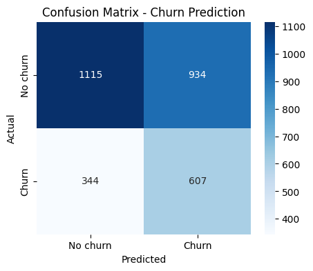

# Prediction of Customer Abandonment (Churn prediction) 📉

## General specifications 📄

### What kind of AI is it? 🤖

> Supervised classification

This project is:
* Supervised Machine Learning
* Binary classification problem
  * 0 → Client is left
  * 1 → Client leaves (churn)

### Natural flow of this project 🎢

1. Load data
2. Exploratory analysis (EDA)
3. Cleaning of data
4. Feature engineering
5. Split train / test
6. Training of the model
7. Evaluation
8. Interpretation of the result

### Meaning of the columns in churn.csv

1. tenure -> Months the customer has been in the company
2. monthly_charges -> Monthly payment
3. total_charges -> Total invoice
4. contract_type -> Contract type
5. payment_method -> Payment method
6. churn -> Is the client leaving?

---

## 01_exploration.ipynb

### What is this model for? 📌

The objective is to identify customers with a high probability of leaving the service so that the company can take preventive actions (offers, support, retention), reducing losses and improving revenues.

### How to interpret the results?

* **1115 (TN):** Customers who were not leaving and the model said they are not going right
* **607 (TP):** Customers who were leaving and the model detected them -> 🔥 the most valuable
* **934 (FP):** Customers who did not leave, but the model said yes -> false alarms (cost money, but no customers)
* **344 (FN) ⚠️:** Customers who were leaving and the model did NOT detect them -> direct loss of customers

---

## 02_predictions.ipynb

### What does it do? 📌

This notebook trains a simple churn model using only charge features and generates churn probabilities per customer.

### Output

- Displays the top churn-risk customers (probability ≥ 0.50).
- Provides a button to export the filtered results to `data/churn_predictions.csv`.

---

## License ©️

This project is licensed under the MIT License.
